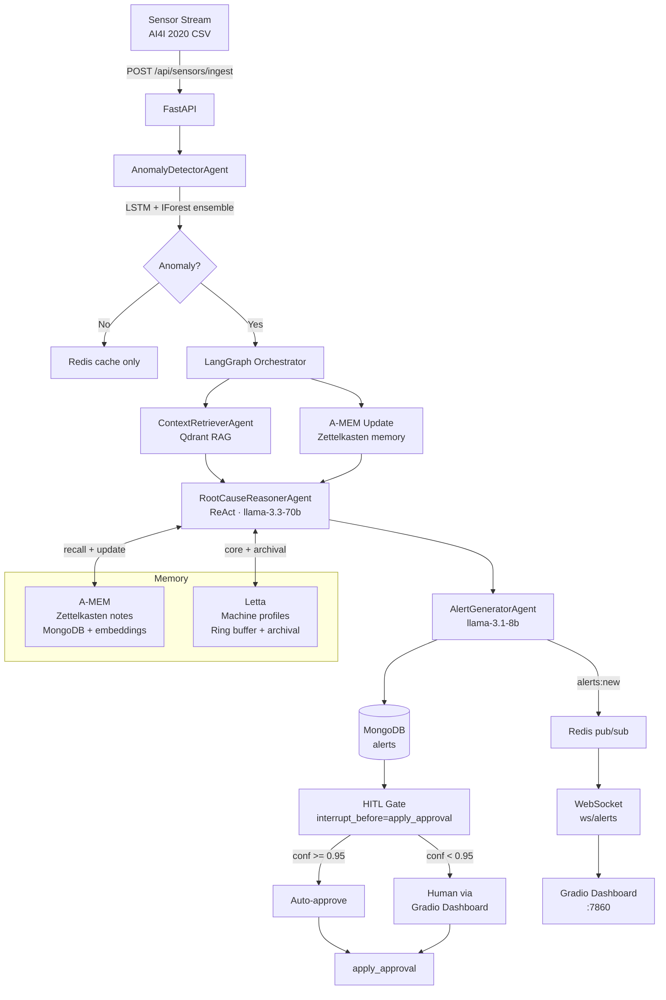

# DefectSense

**Manufacturing Defect Root-Cause Intelligence — Hybrid ML + GenAI Multi-Agent System**

[](https://python.org)
[](https://fastapi.tiangolo.com)
[](https://langchain-ai.github.io/langgraph)
[](https://groq.com)
[](#testing)

---

## Problem Statement

Manufacturing plants lose **$260 billion/year** to unplanned downtime (Deloitte, 2024).
Existing condition-monitoring systems detect *when* a machine fails — but can't explain *why*.

**DefectSense** bridges that gap:

> *"Not just an alert that the machine is broken — a reasoned explanation of the root cause,
> ranked maintenance actions, and an agentic memory that improves with every incident."*

---

## Architecture



---

## ML Model Performance

Evaluated on AI4I 2020 dataset — **2,000-row held-out test set** (last 20%), 39 failures (1.9%).

| Model | Precision | Recall | F1 | AUC |
|---|---|---|---|---|
| Isolation Forest | 0.196 | 0.231 | 0.212 | **0.929** |
| LSTM Autoencoder | 0.000 | 0.000 | 0.000 | 0.455 |
| **Ensemble** | **0.200** | **0.237** | **0.217** | **0.905** |

> **Note on metrics:** AUC is the primary metric for anomaly detection on imbalanced data
> (1.9% failure rate). Isolation Forest AUC **0.929** means the model correctly ranks
> 93% of failure-normal pairs. Low precision/recall reflects the binary threshold,
> not the ranking quality. In production, lowering the threshold trades precision for
> higher recall — critical for safety-first manufacturing environments.
>
> LSTM alone underperforms because it was trained on all data (including failure sequences),
> making reconstruction error unreliable in isolation. It contributes to ensemble confidence
> scoring but the Isolation Forest drives the primary detection signal.

Run evaluation yourself:
```bash
python evaluation/run_evaluation.py
# → evaluation/ml_benchmark.json
```

---

## Key Features

### 1. Hybrid ML + GenAI Detection
Two-stage pipeline: LSTM Autoencoder (sequence anomaly score) + Isolation Forest
(single-point outlier) form an ensemble. High-confidence = both agree.
Low-confidence = either flags. Anomaly score drives LLM reasoning priority.

### 2. ReAct Root Cause Reasoning
`RootCauseReasonerAgent` runs a full THINK → ACT → OBSERVE → CONCLUDE loop via
`llama-3.3-70b-versatile`. Each step is logged in the reasoning trace visible in the
dashboard's Root Cause tab. The agent synthesises RAG context, sensor trends, and
memory into a structured `RootCauseReport` with confidence score and ranked actions.

### 3. A-MEM Agentic Memory (Zettelkasten)
Each reasoning session creates a memory note. Notes auto-link to semantically similar
past notes (cosine similarity > 0.75). Future sessions recall linked notes, so the
agent's context improves with every incident — like a knowledge base that builds itself.

### 4. Letta Stateful Machine Memory
Per-machine profiles in Letta core memory: recent failure patterns, maintenance history
summaries. Archival memory stores all past RootCauseReports. The reasoner injects this
context automatically, personalising analysis per machine.

### 5. Human-in-the-Loop with LangGraph
LangGraph state machine with `interrupt_before=["apply_approval"]`. Alerts are saved
to MongoDB immediately after generation (approved=None). Human approves/rejects via
the dashboard or API. Auto-approve fires if `confidence >= 0.95`. 15-minute timeout
escalates unapproved alerts automatically.

### 6. Real-time Streaming
WebSocket endpoints (`ws/alerts`, `ws/sensors`) backed by Redis pub/sub. Gradio
dashboard auto-refreshes every 5 seconds. Stream simulator replays the AI4I dataset
at configurable speed for demos.

---

## Tech Stack

| Layer | Technology |
|---|---|
| **API** | FastAPI 0.135, Pydantic v2, Uvicorn |
| **Orchestration** | LangGraph 1.1 (HITL state machine) |
| **LLM** | Groq API — llama-3.3-70b (reasoning) + llama-3.1-8b (alerts) |
| **ML** | TensorFlow 2.21 (LSTM Autoencoder) + scikit-learn (Isolation Forest) |
| **RAG** | Qdrant Cloud (vector store) + sentence-transformers/all-MiniLM-L6-v2 |
| **Agent Memory** | A-MEM custom (Zettelkasten, MongoDB) + Letta (MemGPT-style) |
| **Databases** | MongoDB Atlas (motor async) · Redis/Upstash (pub/sub + cache) |
| **Frontend** | Gradio 6.9, Plotly 6.6 |
| **Observability** | MLflow (live prediction tracking) · LangSmith (LLM traces) |
| **Dataset** | AI4I 2020 Predictive Maintenance (10,000 rows, 5 failure types) |

---

## Quick Start

### Prerequisites
- Python 3.11+
- API keys: Groq, Qdrant Cloud, MongoDB Atlas, Upstash Redis, LangSmith

### 1. Clone and install
```bash
git clone https://github.com/Shital16-hub/defectsense.git
cd defectsense
python -m venv venv
source venv/bin/activate        # Windows: venv\Scripts\activate
pip install -r requirements.txt
```

### 2. Configure environment
```bash
cp .env.example .env
# Edit .env — add your API keys
```

### 3. Train ML models
```bash
python ml/train_autoencoder.py
python ml/train_isolation_forest.py
# Models saved to ml/models/
```

### 4. Index maintenance logs (RAG knowledge base)
```bash
python data/index_maintenance_logs.py
# Indexes 500 synthetic maintenance logs into Qdrant
```

### 5. Start the system
```bash
# Terminal 1 — API server
uvicorn app.main:app --port 8080 --reload

# Terminal 2 — Gradio dashboard
python frontend/app.py

# Terminal 3 — Stream simulator (demo data)
python data/stream_simulator.py
```

Open **http://localhost:7860** for the dashboard.

### 6. Run tests
```bash
pytest tests/ -v
# 58 tests across ML models, agents, and API layer
```

---

## Project Structure

```
defectsense/
├── app/
│   ├── agents/          # AnomalyDetector, ContextRetriever, RootCauseReasoner,
│   │   │                  AlertGenerator, Orchestrator (LangGraph)
│   ├── api/routes/      # sensors, alerts, dashboard endpoints
│   ├── api/websocket.py # Redis pub/sub WebSocket hub
│   ├── models/          # Pydantic v2 data models
│   ├── services/        # ML, Redis, MongoDB, Qdrant, A-MEM, Letta
│   └── main.py          # FastAPI lifespan, router registration
├── ml/
│   ├── models/          # Trained artefacts (.keras, .pkl)
│   ├── train_autoencoder.py
│   └── train_isolation_forest.py
├── frontend/app.py      # Gradio 4-tab dashboard
├── data/
│   ├── ai4i_2020.csv
│   ├── stream_simulator.py
│   └── test_pipeline.py
├── evaluation/
│   ├── run_evaluation.py
│   └── ml_benchmark.json
└── tests/               # 58 pytest tests
```

---

## Engineering Decisions

**Why Groq instead of OpenAI?**
Groq's llama-3.3-70b delivers sub-2-second reasoning responses on manufacturing
anomaly prompts — critical for a real-time monitoring system where alerts must appear
within seconds of detection, not minutes.

**Why IForest + LSTM ensemble instead of one model?**
IForest detects single-point outliers well (sudden sensor spike) but misses
gradual drift. LSTM catches temporal patterns across a 30-reading window but requires
history. Ensemble combines both: IForest provides immediate detection, LSTM improves
confidence when history is available.

**Why LangGraph for orchestration?**
Human-in-the-loop interrupts are a first-class LangGraph concept. The
`interrupt_before` API integrates naturally with the async FastAPI backend and allows
the pipeline to pause, wait for human input, and resume — with full state persistence
via `MemorySaver`.

**Why A-MEM + Letta (custom implementations)?**
The official libraries weren't stable enough for production use at project start.
Custom implementations gave full control over the memory format, embedding storage,
and Zettelkasten linking logic — and avoided dependency hell.

---

## Dataset

**AI4I 2020 Predictive Maintenance Dataset** (UCI Machine Learning Repository)

- 10,000 synthetic CNC machine readings
- 5 failure types: TWF (tool wear), HDF (heat dissipation), PWF (power),
  OSF (overstrain), RNF (random)
- 339 failure rows (3.4%)
- Features: air temp, process temp, rotational speed, torque, tool wear

---

*Built by Shital Nandre as a portfolio project targeting industrial AI roles.*
*Stack: FastAPI · LangGraph · Groq · TensorFlow · Qdrant · MongoDB · Redis · Gradio*
